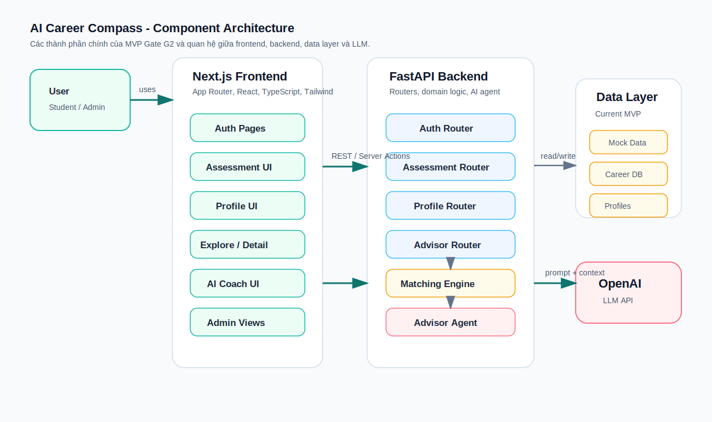
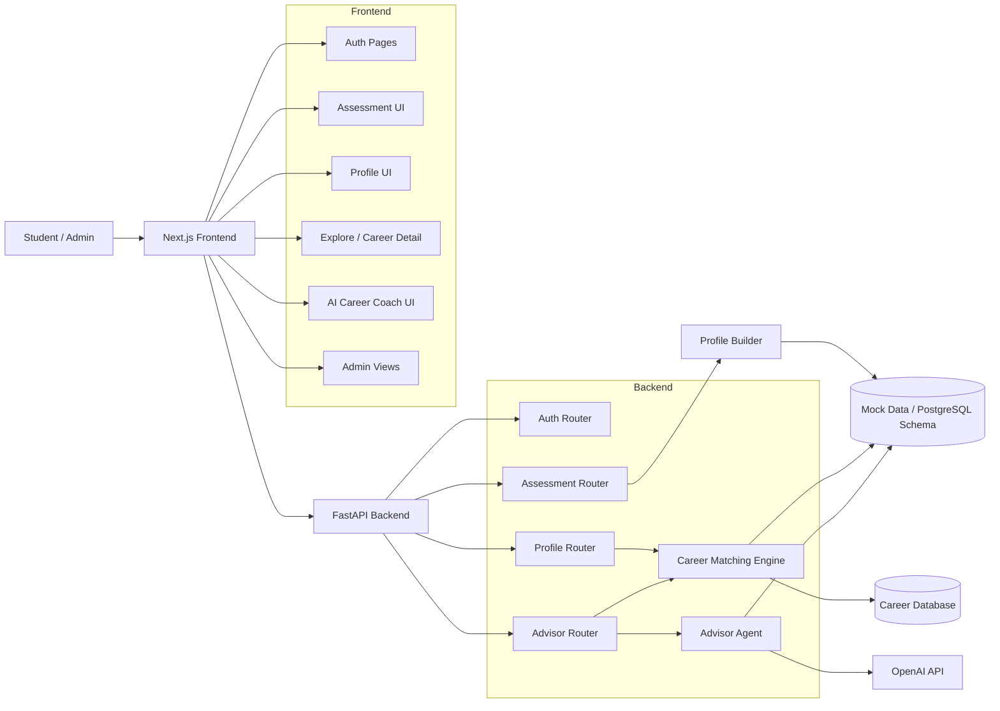
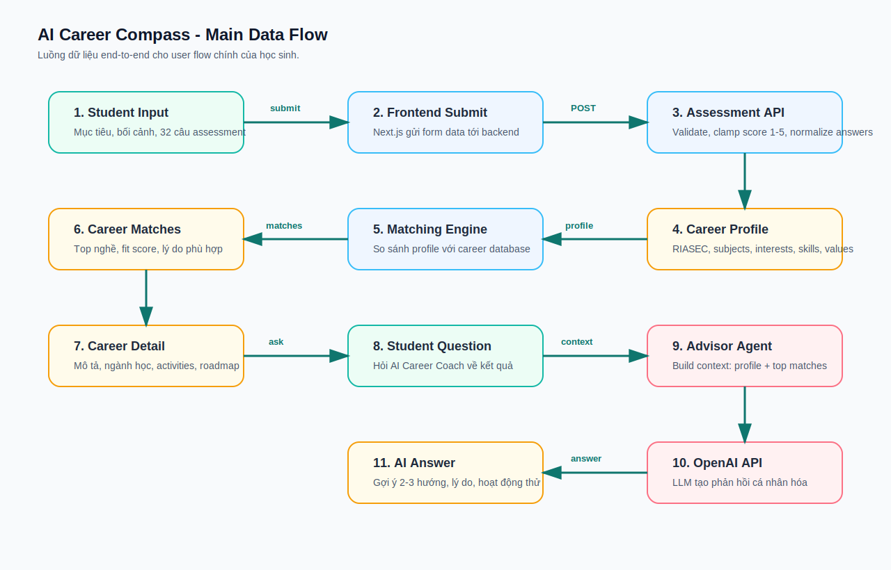
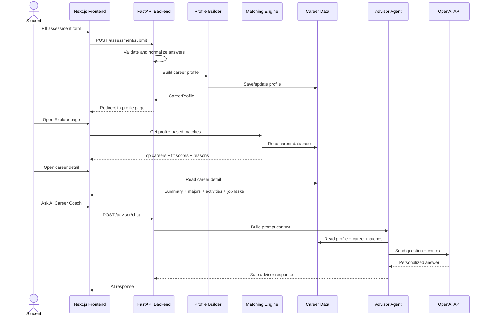

# Architecture Diagram - Gate G2

Tài liệu này mô tả kiến trúc component và data flow chính của AI Career Compass MVP.

## 1. Component Architecture

Sơ đồ component cho thấy hệ thống có 4 lớp chính:

- **User layer:** học sinh hoặc admin thao tác với web app.
- **Frontend:** Next.js App Router, React, TypeScript và Tailwind CSS. Các màn hình chính gồm login/register, assessment, profile, explore/career detail, AI Career Coach và admin views.
- **Backend:** FastAPI xử lý auth, assessment, profile, advisor, matching engine và advisor agent.
- **Data/AI layer:** dữ liệu demo/mock data hiện tại, schema PostgreSQL/Prisma cho hướng tích hợp DB, career database, profile người dùng và OpenAI API cho LLM.

## 2. Main Data Flow

Luồng chính của học sinh:

1. Học sinh nhập mục tiêu, bối cảnh và trả lời assessment.
2. Frontend gửi dữ liệu assessment sang backend.
3. Backend validate câu trả lời, chuẩn hóa điểm từ 1 đến 5.
4. Hệ thống tạo `CareerProfile` gồm RIASEC, môn học, sở thích, kỹ năng và giá trị nghề nghiệp.
5. Matching engine so sánh profile với career database.
6. Frontend hiển thị top nghề, fit score và lý do phù hợp.
7. Học sinh mở chi tiết nghề để xem mô tả, ngành học, nhiệm vụ công việc và hoạt động trải nghiệm.
8. Học sinh hỏi AI Career Coach.
9. Advisor agent build context từ profile và top career matches.
10. Backend gửi context tới OpenAI API.
11. AI trả về phản hồi cá nhân hóa cho học sinh.

## 3. Notes For Gate G2

- User flow chính đã có input, xử lý và output có ý nghĩa.
- Matching hiện tại chạy bằng rule-based scoring từ profile và career database.
- AI Career Coach dùng profile + top matches làm context để gọi LLM.
- Data layer hiện tại vẫn có mock data trong app, đồng thời project đã có Prisma/PostgreSQL schema để mở rộng sang DB thật.
